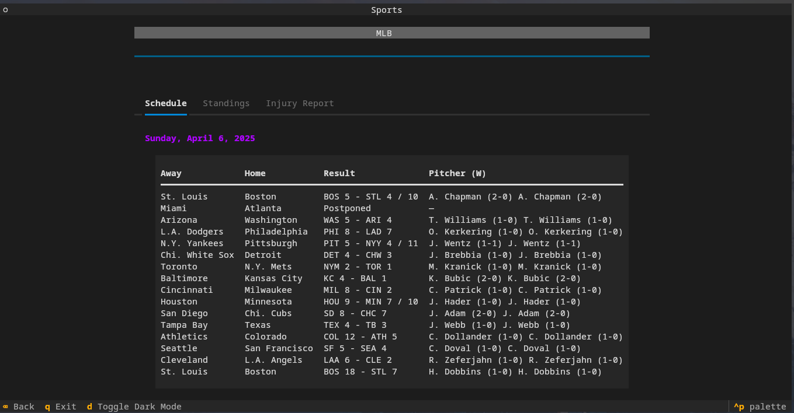

# Sports Terminal App

a simple sports tui app written in python using [textual](https://textual.textualize.io/).

see the following data:
- Schedule 
- Standings
- Injury

for each major sport:
- MLB
- NBA
- NFL
- NHL

all data is scraped from [CBS Sports](https://cbssports.com).

---


---

## How to Run:

#### Run using Python 
install packages locally or to virtual enviornment.
```
$ pip install -r requirements.txt
$ python sports_tui.py
```

#### Create executable file
use pyinstaller to create an executable file for your operating system.
run file direcly in folder or place executable in path to run anywhere.
script creates a sports executable file. this can be changed by editing the `--name` flag in the script.
```
$ ./compile.sh
$ cd dist
$ ./sports
```
